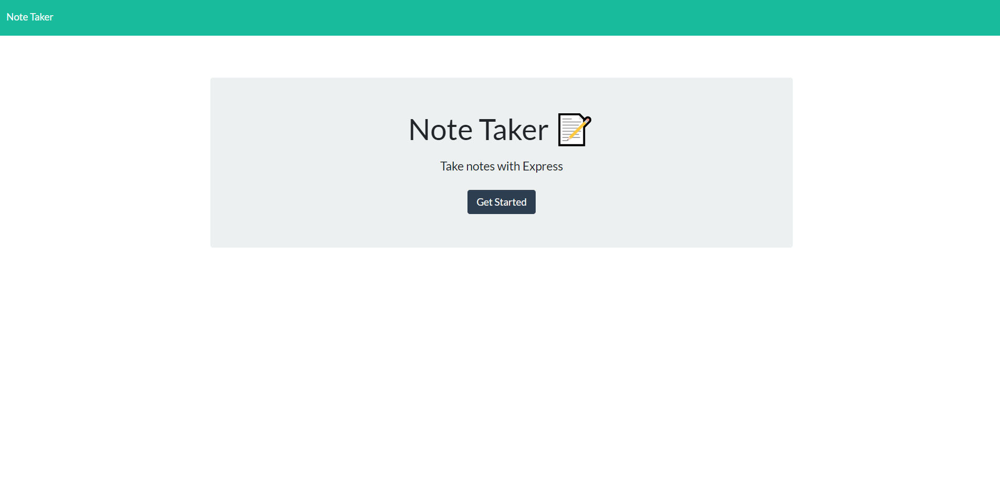
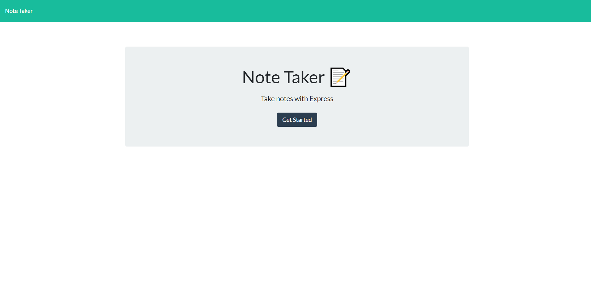

# Taking-Note

## Description
Some features of this application.
1. When application is opened a link to the note page is displayed and can be clicked on.
2. Once link to note page is clicked on a page will display with existing notes and an empty field for saving more notes.
3. When a new note is saved it will appear in the left-hand column.
4. Notes in the left hand column can be clicked on to view again and can also be deleted.

---

## Table of content

* [Description](#description)

* [Usage](#usage)

* [How to Contribute](#how-to-contribute)

* [Links](#links)

* [Questions](#questions)

* [Pictures](#pictures)

---

## Usage

For saving notes.

## How to Contribute

Pull requests. Feel free to open a pull requst on my GitHub.

## Questions

If you have nay questions about this project then you can contact me directly at 

liz@durableprogramming.com

----

## Links

[GitHub Repo](https://github.com/elizabethdberube/Taking-Note) 

[Deployed Application](https://intense-cove-80644.herokuapp.com/) 

----

## Pictures

